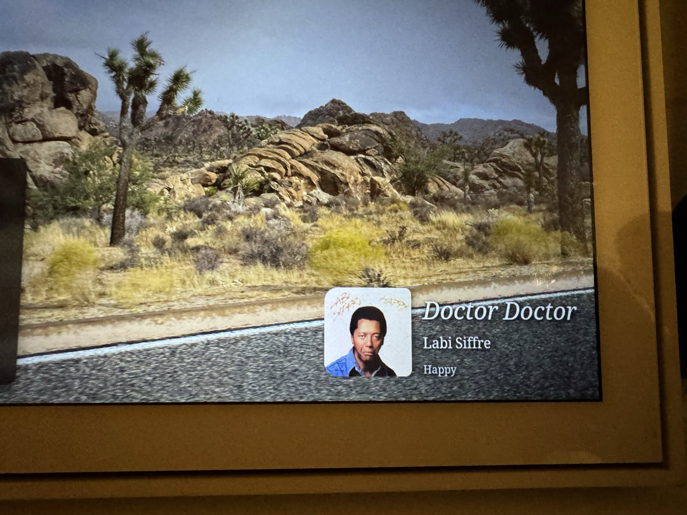

<div align="center">
  
  <h1>Wormhole Display</h1>
  <p><strong>Give your Meta Portal a second life as a wireless display and speaker for your Mac, iPhone and iPad.</strong></p>
  <p>AirPlay-compatible screen mirroring &amp; extended display receiver.</p>
</div>

> *"A wormhole connects two distant points in spacetime. Wormhole Display bridges two ecosystems that were never meant to talk to each other..."*

<p align="center">
  <br />
  <em>Wormhole Display on a Portal+ (Gen 2)</em>
</p>

---

## A second life for your Portal

Meta Portal devices are no longer made or sold, but the hardware is still great: sharp screens, good speakers, and a TV model that plugs into any HDMI input. Wormhole Display turns a Portal into a screen your Mac, iPhone or iPad can use straight from **Control Center → Screen Mirroring**, as an extended display or a mirror, with sound. Nothing needs to be installed on the sender.

It is an ordinary app that runs alongside Portal OS: **no root, no firmware changes, and no Meta services**. It only talks to Apple devices on your local Wi-Fi.

- **Portal+ (Gen 2)**: a 14″ 2160×1440 extended display, with speakers, for your Mac.
- **Portal Mini (8″)**: compact desktop display supporting both portrait and landscape.
- **Portal Go**: a battery-powered wireless display you can carry from room to room.
- **Portal TV**: turns your TV into a Screen Mirroring target, navigated with the Portal TV remote.

Wormhole Display is an independent community project and is not affiliated with Meta or Apple; see the legal section below.

---

## Features

- **Shows up like any AirPlay display**: your Portal appears in Screen Mirroring as *Wormhole Plus*, *Wormhole Go* or *Wormhole TV*, or under a name you choose.
- **Extended display or mirror**: macOS can use the Portal as a second screen, advertised at the panel's native resolution and refresh rate.
- **Portrait & Landscape orientation**: choose between Landscape (widescreen), Portrait (tall), or Auto-detect. On rotatable hardware (like Portal Mini), **Auto** mode uses the device's tilt sensor to automatically flip the advertised AirPlay geometry when you physically rotate the display. Fixed-stand models (Portal TV, Portal Go, Portal+ Gen 2) default to Landscape, with manual Portrait selection available.
- **Hardware video decoding**: H.264 on the Portal's hardware decoder, with experimental HEVC for senders that support it.
- **Sound through the Portal**: audio plays on the Portal's speakers and can be muted from the dashboard.
- **AirPlay speaker (audio-only)**: play music straight to the Portal from an **iPhone or iPad** (Control Center → AirPlay, or the AirPlay button in Apple Music, Podcasts, etc.), without mirroring. ALAC is decoded on-device.
- **Home Assistant now-playing (optional)**: publish the current track (title, artist, album, cover art) to a Home Assistant entity, so a wall-panel dashboard can show what the Portal is playing. Off by default; configured in the app.
- **Opens when you connect**: the receiver stays available in the background and brings itself full screen when a stream starts. It can also start when the Portal boots.
- **Back or Home to disconnect**: leaving the stream on the Portal ends the session on your Mac or iPhone too.
- **Several Portals, one network**: each device has its own identity, so a Portal+ and a Portal TV can both be available at once.
- **Remote-friendly on Portal TV**: full D-pad navigation with clear focus highlights.
- **Dashboard and stats**: network details, recommended resolutions, recent connections, and an optional on-screen stats overlay (FPS, bitrate, codec).

---

## Compatibility

Tested on:

| Device | Display | Audio | Orientation | Input |
|---|---|---|---|---|
| **Portal+ (Gen 2)** | 14″ 2160×1440 (3:2), 60 Hz | Stereo + subwoofer | Fixed tilt (Landscape default, manual portrait) | Touch |
| **Portal Mini (8″)** | 8″ 1280×800 (16:10), 60 Hz | Stereo | Dual-orientation body (Auto & manual) | Touch |
| **Portal Go** | 10.1″ 1280×800 (16:10), 60 Hz | Stereo, battery powered | Fixed wedge (Landscape default, manual portrait) | Touch |
| **Portal TV** | Your TV over HDMI, 1080p (16:9), 60 Hz | TV or soundbar via HDMI | Fixed (Landscape default, manual portrait) | Remote (D-pad) |

Other Portal models haven't been tested yet; reports are welcome. Other Android 9+ (API 28+) 64-bit ARM devices may also work, but are untested.

---

## Setting up your Portal

### 1. Prepare your Portal

Installing the app needs ADB (Android Debug Bridge) access to your Portal. Follow Meta's official guide, [Set up your device](https://developers.meta.com/horizon/documentation/android-apps/portal-setup/), to turn on ADB in the Portal's settings and connect it to your computer over USB-C. You'll also need Google's [Android SDK Platform-Tools](https://developer.android.com/tools/releases/platform-tools), which include `adb`.

Check the connection with `adb devices`; your Portal should be listed as `device`.

### 2. Install the app

Download `wormhole-display.apk` from the newest `vX.Y.Z` release on this repository's **Releases** page (the *latest* pre-release is an automatic build of the main branch), then install it:

```bash
adb install -r wormhole-display.apk
```

### 3. First launch

Open **Wormhole Display** from the Portal's apps list (on Portal TV, use the apps row with the remote). On the dashboard, tap **Allow** next to *Auto-open on connect* and turn on **Display over other apps**. Android only lets the receiver bring itself to the front for an incoming stream with that permission; without it, the stream still plays but you have to open the app yourself.

Leave **Run in Background** on so your Portal stays available in Screen Mirroring after you close the app.

---

## Connecting

### From a Mac

1. Make sure your Mac and Portal are on the same Wi-Fi network.
2. Open **Control Center → Screen Mirroring** and pick your Portal:
   - **Wormhole Plus**: Portal+ (2160×1440, 3:2)
   - **Wormhole Go**: Portal Go (1280×800, 16:10)
   - **Wormhole TV**: Portal TV (1080p, 16:9)
3. In **System Settings → Displays**, choose **Extended display** or **Mirror**. Turn on *Show all resolutions* to pick an exact native mode and avoid letterboxing. For crisp text on a Portal+, see the [Text Sharpness Guide](docs/macos-text-sharpness.md).

### From an iPhone or iPad

Open **Control Center → Screen Mirroring** and pick your Portal.

### Ending a session

Press **Back** or **Home** on the Portal, or stop Screen Mirroring on your Mac, iPhone or iPad.

---

## Home Assistant now-playing (optional)

If you use a Portal as a Home Assistant wall panel, Wormhole Display can publish
what's currently AirPlaying to a Home Assistant entity, so a dashboard card can
show the title, artist, album and cover art.

It uses Home Assistant's REST API over your local network — no add-on or MQTT
broker required.

<p align="center"><br/><em>Now-playing surfaced on a Portal used as a Home Assistant wall panel</em></p>

1. In Home Assistant, open your **profile** (bottom of the sidebar) and, under
   *Long-Lived Access Tokens*, **Create Token**. Copy it.
2. In Wormhole Display, open **Settings → Home Assistant**, turn it **On**, and enter:
   - **Base URL** — e.g. `http://homeassistant.local:8123` (or `http://<ha-ip>:8123`)
   - **Long-Lived Access Token** — the token from step 1
   - **Entity ID** — defaults to `sensor.wormhole_now_playing`
3. Play something to the Portal over AirPlay. The entity updates with:
   `state` (track title), and attributes `media_title`, `media_artist`,
   `media_album_name`, `media_year`, `media_duration`, `media_position`, and
   `entity_picture` (cover art, served from the Portal on your LAN).

Example dashboard card (Markdown):

```yaml
type: markdown
content: >
  
  
  
  

  **{{ state_attr(e,'media_title') }}**

  {{ state_attr(e,'media_artist') }} — {{ state_attr(e,'media_album_name') }}
  _Nothing playing_
```

Notes:
- The entity is created via the REST API, so it resets to *idle* if Home
  Assistant restarts while nothing is playing; it repopulates on the next track.
- Cover art is served from a small HTTP endpoint on the Portal
  (`http://<portal-ip>:8098/art.jpg`); Home Assistant clients fetch it directly
  over the LAN.
- Metadata is only as good as the sender provides. iOS/iPadOS senders send full
  metadata and artwork; some senders send less.

## Building from source

Requirements:

- **JDK 17**
- **Android SDK** (`ANDROID_HOME` pointing to your SDK directory)
- **Android NDK r27d** (only needed if you change native C code; prebuilt static libraries for OpenSSL and libplist are committed under `app/src/main/cpp/deps/`)

```bash
# Build the APK (outputs to dist/wormhole-display.apk)
./scripts/build.sh

# Install and launch on a connected Portal
adb install -r dist/wormhole-display.apk
adb shell am start -n io.github.pgodlews.wormhole/.MainActivity
```

Protocol details, contributor notes and troubleshooting are in [AGENTS.md](AGENTS.md) and [docs/architecture.md](docs/architecture.md).

---

## How it works

Wormhole Display is built on an Android port of [UxPlay](https://github.com/FDH2/UxPlay)'s C core (RTSP/RAOP, pairing, AES decryption, and an embedded mDNS responder). UxPlay's desktop GStreamer pipelines are replaced with Android's hardware `MediaCodec` for video and low-latency `AudioTrack` for audio.

---

## Security

Wormhole Display accepts screen-mirroring connections from **any device on your local network, without a PIN or password**. Run it only on networks you trust.

---

## Legal & Trademark Disclaimers

### Non-Affiliation Disclaimer
**Wormhole Display** is an independent, community-developed open-source software project. It is not manufactured, endorsed, sponsored, affiliated with, or supported by **Apple Inc.** or **Meta Platforms, Inc.**

### Nominative Fair Use
- **Apple**, **AirPlay**, **macOS**, **iOS**, **Mac**, **MacBook**, **Retina**, and **Bonjour** are trademarks or registered trademarks of **Apple Inc.** in the United States and other countries.
- **Meta**, **Portal**, **Portal+**, **Portal Go**, and **Portal TV** are trademarks or registered trademarks of **Meta Platforms, Inc.**

All brand names, trademarks, product designations, and logos referenced in this repository are used strictly under **Nominative Fair Use** for technical identification, device interoperability, and accurate descriptive compatibility purposes.

---

## License

Copyright © 2026 Piotr Godlewski

Wormhole Display is licensed under the **GNU General Public License v3.0 (GPLv3)** — see [LICENSE](LICENSE). It links and builds upon UxPlay (GPLv3); bundled third-party components keep their own copyrights and licenses, listed in [THIRD_PARTY_NOTICES.md](THIRD_PARTY_NOTICES.md).
