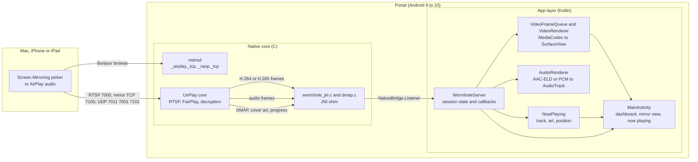
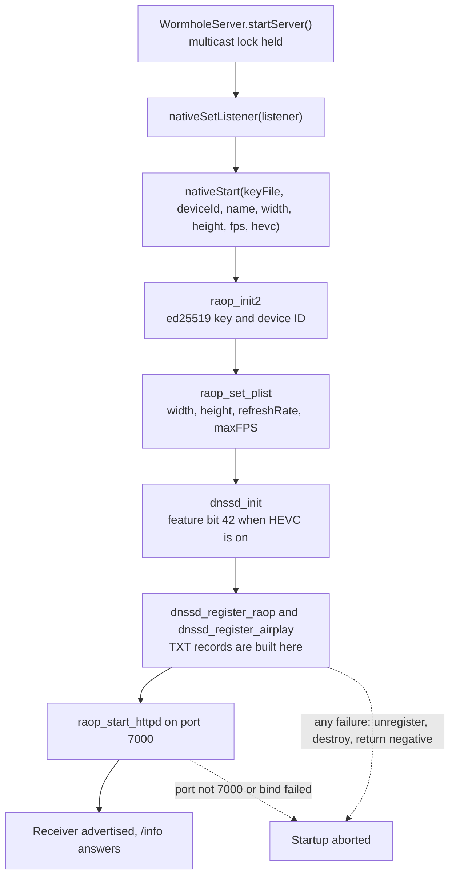
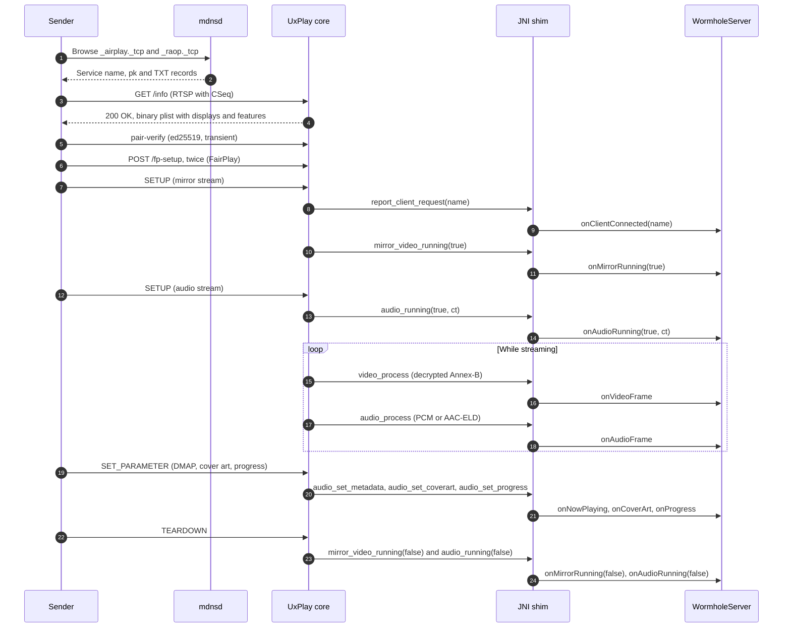
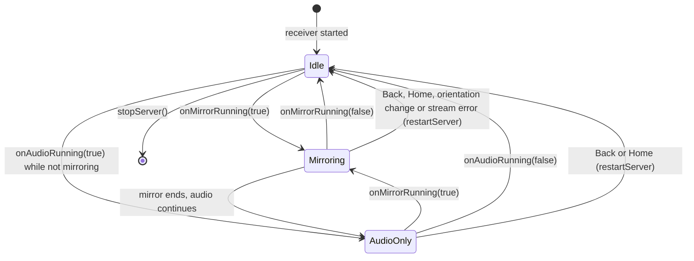
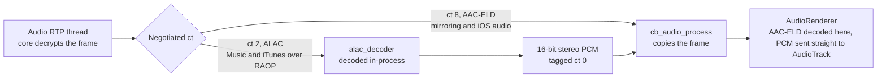
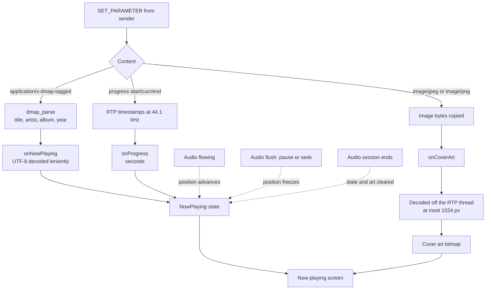

# Wormhole Display — architecture

Goal: an Android device appears in the macOS/iOS **Screen Mirroring** picker and
accepts a native mirroring or extended-display session, with audio, and no
companion app on the sender.

## Approach

A port of the mirroring core of [UxPlay](https://github.com/FDH2/UxPlay) (C, `lib/`,
vendored at `app/src/main/cpp/uxplay/`) to Android, replacing its GStreamer
renderers with `MediaCodec` + `SurfaceView` for video and `AudioTrack` for audio:

- **Protocol core** (`raop*.c`, `httpd.c`, `llhttp/`) — RTSP/HTTP control channel.
- **Crypto** (`playfair/`, `pairing.c`, `srp.c`, `crypto.c`) — pairing handshake and
  stream decryption; uses a static OpenSSL `libcrypto` for arm64.
- **Discovery** — UxPlay's bundled internal mDNS responder (`lib/mdnsd/`). Android's
  `NsdManager` cannot publish TXT records before API 31 (Portal devices run API
  28–29), and the `/info` handler asserts on the C `dnssd` object anyway, so
  advertisement stays native.
- **JNI shim** (`cpp/wormhole_jni.c`) — server lifecycle and core callbacks.
  Decrypted Annex-B H.264/HEVC is copied to `VideoFrameQueue` → `VideoRenderer`
  (hardware `MediaCodec` on a `Surface`); decrypted AAC-ELD is copied to
  `AudioRenderer`.
- **Now-playing callbacks** — the core hands over the metadata an audio sender
  attaches with `SET_PARAMETER`: DMAP track info, cover art and `progress:` RTP
  timestamps. The shim parses DMAP (`cpp/dmap.c`) and forwards
  `NativeBridge.Listener.onNowPlaying`, `onCoverArt` and `onProgress`. They run on the
  audio RTP thread, only between `onAudioRunning(true)` and `onAudioRunning(false)`,
  and are default no-ops on the listener. Track text is decoded leniently through
  `String(bytes, "UTF-8")`, since senders' bytes need not be the modified UTF-8 that
  `NewStringUTF` requires. `WormholeServer` keeps a `NowPlaying` state (position is
  extrapolated while audio flows and frozen on a flush) and decodes the art off the
  RTP thread; `MainActivity` shows it full screen for audio-only sessions.
- **App layer** (Kotlin) — `WormholeService` (foreground service, multicast and
  wake locks, boot autostart), `WormholeServer` (process-wide owner of the native
  server, renderers and UI state), `MainActivity` (Compose dashboard and video
  surface), and `ScreenOrientation` (portrait/landscape/auto management with sensor
  handling).

Changes to the vendored core are listed in [uxplay-patches.md](uxplay-patches.md).

## System overview

A sender finds the receiver over Bonjour, then streams through the native core. The
JNI shim is the only code that touches both sides.

## Server startup

The order matters. `/info` reads TXT records from the `dnssd` object, so registration
must finish before the HTTP listener starts. A failure at any step unwinds what was
built so far, and `nativeStart` returns a negative code.

## Connection flow

Both streams start during `SETUP`, not `RECORD`. The client-connected callback fires
first, then the mirror stream and the audio stream each report when they start, and
`TEARDOWN` reports them stopped. Metadata arrives on `SET_PARAMETER` while the session
runs.

## Session states

`WormholeServer` derives the UI state from these callbacks. Audio that arrives during a
mirroring session does not change the state, because mirroring already owns the screen.
Back, Home, orientation changes and stream errors restart the native receiver, which
resets the state to Idle.

## Audio path

Mirroring and iOS audio-only send AAC-ELD (`ct` 8), which the Kotlin renderer decodes.
Music and iTunes over legacy RAOP send ALAC (`ct` 2). The shim decodes that to PCM
before the JNI hop, because the Portal has no ALAC `MediaCodec` decoder.

## Now-playing data

The shim parses or forwards the track info, cover art and progress that the sender
attaches. `NowPlaying` keeps the position moving between sender updates: it advances
while audio is flowing and freezes on a flush (pause or seek). Art is decoded off the
RTP thread and dropped if its session has already ended.

## Protocol knobs

Senders change the protocol periodically; the moving knobs are `model`, `srcvers`,
and the `features` bitmask built by the vendored `dnssd` from `lib/dnssdint.h`
(currently `AppleTV3,2` / `220.68` / `0x5A7FFEE6,0x0`, UxPlay's defaults; bit 42
is added when experimental HEVC is enabled). Display geometry is advertised from
real panel metrics via `raop_set_plist` in `wormhole_jni.c` — senders stream at
whatever size is advertised. When screen orientation changes (either via manual toggle
or physical device rotation on supported models such as Portal Mini),
active mirroring clients are disconnected and the receiver restarts with transposed
width/height values so connecting senders pick up the updated geometry in `/info`.

## Licensing

UxPlay is GPLv3 (its `lib/` mirroring core is LGPLv2.1+; bundled `llhttp` is MIT,
`mdnsd` is BSD-like). This repository is therefore GPLv3 as a whole (see
[LICENSE](../LICENSE) and [THIRD_PARTY_NOTICES.md](../THIRD_PARTY_NOTICES.md)).

## Known limitations

- Wi-Fi only; sender and receiver must be on the same LAN (no AWDL).
- No PIN or password admission: any device on the LAN can connect.
- The sender chooses mirroring vs extended display and the codec; advertising
  HEVC support does not force HEVC.
